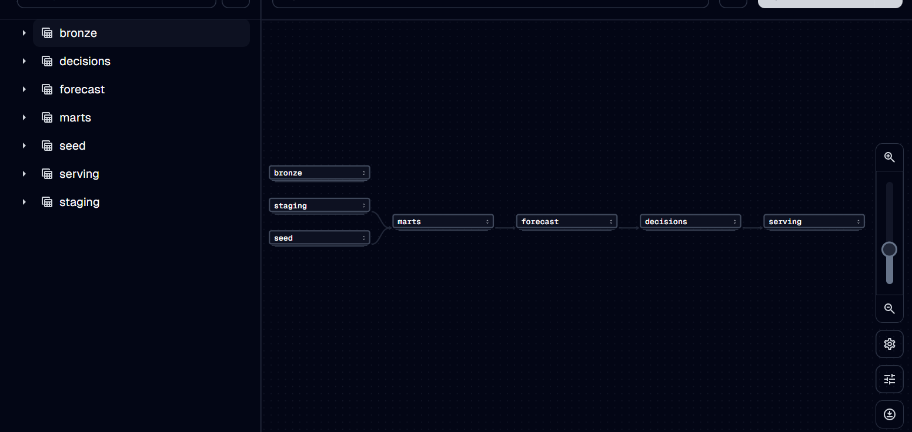

# FreshFlow

[](https://github.com/Yadnesh02/freshflow-qcommerce-analytics/actions/workflows/ci.yml)
[](https://github.com/Yadnesh02/freshflow-qcommerce-analytics/actions/workflows/warehouse.yml)
[](https://yadnesh02.github.io/freshflow-qcommerce-analytics/)

**A quick-commerce deal rail loses ₹4.4 lakh a year. Does it pay for itself — and for whom?**

Blinkit, Zepto and Instamart all run a rupee-store rail: one deeply discounted hero SKU, rotated
daily, capped at one per order. It is a loss leader by construction, and this one behaves like one —
**11,696 units sold for ₹127,820 against ₹564,591 of cost, a ₹436,771 hole over a simulated year.**

Platforms run it anyway, on the theory that the loss is bought back twice: by the rest of the basket
the deal pulls in, and by the customers it brings back. Both halves of that theory are measurable,
and neither is usually measured.

> **The question this project answers:** does the rail earn back its subsidy — and if it does not
> earn it back from everyone, who is it worth showing to?

Underneath sits a full dark-store analytics platform — 14 stores, ~5.5M order lines a year,
simulated end to end, warehoused in dbt and served through a metric registry. That platform is what
makes the question answerable, and it is described in [the second half of this file](#the-platform-underneath).

> ### On the data
> **All data here is generated by a purpose-built simulator in [`simulator/`](simulator/).** No real
> company data is used and every brand name is fictional. That is a real limitation, and
> [§10 of the plan](docs/PROJECT_1_PLAN.md) sets out how policy impact is measured despite it — a
> controlled A/B backtest with common random numbers, a store-level difference-in-differences
> holdout, sensitivity analysis, and per-component attribution. The analytics layer is
> architecturally forbidden from reading the simulator's parameters, and a test enforces it.

---

## What is measured so far

Four numbers, each traceable to the model that produced it. Three are solid. **The fourth is the
reason this project exists.**

| | |
|---|---|
| **The rail costs** | **−₹436,771** over the simulated year. 11,696 units at an effective ₹10.93 against ₹564,591 of landed cost. Measured on `fct_order_item` where `promo_id = 'PROMO-DEAL11'`. |
| **Uptake is real** | **3.57×** median lift on dealt days, across the 45 SKUs with both dealt and undealt uncensored days — an average store-SKU moving from 0.85 units a day to 3.76. Median rather than mean, because the mean is carried by SKUs that barely sell otherwise. |
| **It reactivates, it does not acquire** | A deal order is **2.1×** more likely to be a customer returning after a 30-day gap (5.31% against 2.48%), and 2.4× at 60 days. First-*ever* orders are slightly **lower** on deal days. |
| **What it earns back** | **4.66× per rupee of subsidy, CI [0.30×, 9.02×]** — measured against a randomised customer-level holdout (D1), on a 90-day validation build. The interval crosses 1×, so on that window the rail cannot yet be shown to pay for itself. The naive observational figure the code used to rely on was +₹6.27 per deal order, which is a different quantity: attach only, with no incidence effect in it. |

The two sit in tension, which is the point: **the rail makes margin inside the window and
costs customers beyond it.** Whether it pays depends on who sees it, which is what D4 exists
to answer.

There is one more finding worth keeping, because it is the opening the project walks through:
**the rail is run as a gimmick rather than a system.** More than half the slots over the year went
to goods with roughly 800 days of shelf life, where clearance value is exactly zero. On the as-of
date, the set of dealt SKUs and the set of SKUs at risk of expiring had an **empty intersection**.

### The three gaps

| | Gap | Where it stands today |
|---|---|---|
| ~~**G1**~~ | ~~The attach number is not causal~~ | **Closed in D2.** [`analytics/deal/attach.py`](analytics/deal/attach.py) estimates it intent-to-treat against D1's randomised holdout, customers who never ordered included as zeros. Full-year figures await a post-D1 warehouse rebuild. |
| ~~**G2**~~ | ~~Retention value is set to zero~~ | **Closed in D3** — and the answer is negative. Exposed customers churn **+1.06pp** more [+0.38, +1.73], because the rail concentrates demand onto SKUs that then run dry: stockout-affected days rise 16%. `reactivation_value` must not be set positive on this evidence. (`retention_90d` in `mart_experiment_readout` belongs to the *store-level* Policy A/B experiment and stays open.) |
| **G3** | Nobody is targeted | Slots are allocated store × SKU × day. There is no *who*. Every feature needed is already in `mart_customer_360` — RFM, cohort, discount-dependency index, 90-day contribution — and no model uses them. |

Closing those three is the work. **[The plan is here](docs/DEAL_PLAN.md)**: four analytical chapters,
seven sprints, each with a gate that can fail.

---

## Status

Sprints 0–5 are complete and all five checkpoint gates pass — the platform below is built, tested
and deployed. Its definition of done stands at **11 items ticked, 2 deferred by decision, 0 open**;
the two deferred are a walkthrough recording and a spoken rehearsal, both with their scripts
written. The project is now being **re-cut around the deal question**, which is where the sharpest
unanswered question in it turned out to be.

| Track | Scope | State |
|---|---|---|
| **Platform** · sprints 0–5 | Simulator, warehouse, decision engines, metric registry, live app, impact proof | ✅ complete — all five gates pass |
| **D0** | Re-headline: README, the question, the plan | ✅ done |
| **D1** | Customer-level randomised deal exposure in the simulator | ✅ done — max SMD 0.028, no deal line reaches the holdout |
| **D2** | Causal attach estimate + cannibalisation event study | ✅ done — 4.66× return [0.30×, 9.02×]; P&L corrected to −₹436,771 |
| **D3** | Retention readout against D1's holdout | ✅ done — the rail **costs** retention: +1.06pp churn [+0.38, +1.73], via stockouts |
| **D4** | Uplift model, Qini curve, targeting policy | ⬜ not started |
| **D5** | Deal-slot allocator re-pointed at measured coefficients | ⬜ not started |
| **D6** | Three-page dashboard, rewritten story | ⬜ not started |

The platform's own build history, its 47 tasks and its five acceptance gates are in
[`docs/EXECUTION_PLAN.md`](docs/EXECUTION_PLAN.md).

---

# The platform underneath

Everything below this line is the machinery the question is answered with. It was built first, it
is complete, and it stands on its own — but it is no longer the headline.

## Stack

`Python 3.12` · `DuckDB` · `dbt` · `Dagster` · `LightGBM` · `PuLP` · `FastAPI` · `Streamlit`

Everything is free and open-source; the project runs end to end on a laptop with no cloud account
and no Docker.

## Architecture

```
simulator ─▶ bronze (parquet) ─▶ silver (dbt staging) ─▶ gold (dbt marts)
                                                            │
                                          ┌─────────────────┴─────────────────┐
                                          ▼                                   ▼
                                   decision layer                    in-house BI layer
                             forecast · elasticity ·            semantic/metrics.yml ─▶
                             markdown · deal slots ·            FastAPI metrics API ─▶
                             transfers · targeting              control tower UI
                                          │
                                     rec_* action tables
                                          │
                                          └──▶ back into the simulator's policy engine
```

That last arrow is the point: recommendations are executed in the next simulated day, so impact is
**measured** rather than estimated.



The same pipeline as an asset graph: 60 assets and 362 checks, with dbt arriving as 54 individual
model assets carrying their real edges rather than one opaque step. Grouped by warehouse layer,
because the default put all 54 in `default` and made the graph unreadable. The nightly schedule
**excludes the simulator** — regenerating the world would make every historical figure
irreproducible.

### ▶ The app

**FreshFlow Control Tower** — seven pages, reading only from the metrics API. Every tile has a
**see query** control that shows the exact SQL that produced its number and the registry definition
that compiled it.

**▶ [Open the live app](https://freshflow-qcommerce-analytics-b2ozx2naawfh7gxubum6gm.streamlit.app/)** — or run it locally with `python tasks.py app`. Expect a
~40 second first load: Streamlit Community Cloud sleeps the app after inactivity, and the container
fetches its warehouse slice from a GitHub Release on wake.

The three pages that answer the deal question land at **D6**. Until then these seven are the
platform's own views.

| Page | The decision it supports |
|---|---|
| **Executive** | Which stores are losing margin to wastage — read next to the retention guardrail, because margin bought by running stores empty looks like a win here and like churn on the customer page. |
| **Expiry Control Tower** | The action queue: every batch about to expire, ranked by rupees at risk, with the forecast that says whether it will actually sell. |
| **Demand & Availability** | Where the forecast beats guessing and where it does not, so ordering can follow the model on the head and a reorder rule on the tail. |
| **Price Elasticity** | What price response was actually measurable, and where it was not — unidentified cells are shown rather than hidden, because a clean curve for every category would imply the last day was measured. |
| **Action Queue** | The four engines' output for one morning, grouped rather than ranked against each other, because an order line and a transfer are different rupees. |
| **Data Quality** | Whether any feed stopped arriving, what the last Soda scan said, and the eight defects injected into the raw layer with the repair for each — a page of green checks would hide the most interesting thing about the build. |
| **Warehouse** | The base rows under every other page, for the question that comes after a number looks wrong. Browsing only: it can window a relation and sort it, and it cannot aggregate — so there is still no route to a figure the registry never declared. |

### Two things vendor BI cannot do

**See query, on every tile.** The response carries the SQL it ran, the metric definition that
compiled it, and the source model. Full lineage from a pixel back to a dbt model, for any number a
reader doubts.

**A rupee-valued action queue as an object, not a table.** `/actions/expiry` returns decisions —
each with a deadline in hours and an expected cost of doing nothing — rather than rows to read.

---

## How a number reaches the screen

```
semantic/metrics.yml   31 metrics, each with numerator, denominator, grain, format, owner
        │
        ▼
semantic/resolver.py   compiles a metric + dimensions + filters into DuckDB SQL
        │              refuses a slice the source cannot reach, rather than cross-joining
        ▼
serving/api            FastAPI. No endpoint accepts SQL. Every response echoes what it ran.
        │
        ▼
serving/web            Streamlit. Imports no database driver at all.
```

**Gate G3 is that no number on screen is absent from the registry**, and this chain is what makes
that structural instead of a convention. There is no second route: a test walks the OpenAPI spec
and fails if any endpoint accepts a statement, and a second walks the dashboard's syntax tree and
fails if any module imports a database driver.

---

## What the platform found

Numbers a reader can check against the code, not claims. The original build set out to resolve the
perishables tension — stock enough never to go out of stock, without stocking so much that fresh
goods expire — and these are what it turned up.

| | |
|---|---|
| **Censored demand** | A SKU that ran out at 07:00 had seen **6.7%** of the day's demand, not the 29% the clock suggests. Correcting by a fitted arrival curve instead of by hours moved measured lost sales from 94,350 to **213,230 units** — and *down* for evening stockouts, which a flat multiplier cannot do. |
| **Forecast** | LightGBM beats seasonal naive on all nine ABC-XYZ classes (**FVA +0.204** on A/X). It beats a *zero* forecast on four of nine — and the app says which, because on 80%-zero series WAPE rewards predicting nothing. |
| **Expiry risk** | Across risk bands, realised write-off runs **0%, 0%, 0%, 1.7%, 42%**. Validated against the seven days after the scoring date, not asserted. |
| **Customers** | Contribution by discount-dependency band reorders at **₹34** delivery cost per order; the assumption in use is ₹42, which sits above it. So "our least discount-dependent customers are the most valuable" is a statement about delivery cost, not about customers. |

Each of those lives in the docstring of the model that produced it, with the query that measured it.

### The platform's own headline, and it is not the one it set out to find

**The optimised policy loses on the metric declared before the experiment ran.**

A store-level randomised holdout — 14 stores, 180 days, half switching to Policy B on day 46, 30
independent seeds — measures this by difference-in-differences:

| Metric | Policy A | Policy B | Difference-in-differences | 95% CI |
|---|---|---|---|---|
| **Gross margin after wastage** — *the north star* | 22.22% | 20.76% | **−1.35pp** | [−1.62, −1.08] |
| Availability | 79.14% | 82.00% | **+2.94pp** | [+2.77, +3.11] |
| Wastage rate on revenue | 1.90% | 3.74% | **+1.80pp** | [+1.59, +2.01] |
| Markdown subsidy per store-day | ₹1,255.27 | ₹325.46 | **−₹1,040.97** | [−1,229, −852] |

Every row is significant across all 30 seeds. Policy B buys **+2.9pp of availability and roughly
doubles write-offs**, and on gross margin after wastage — the rate the metric registry named as the
north star *before* any of this ran — it is **1.35pp worse**. Component attribution puts essentially
all of that on the newsvendor, which trades wastage for availability by design; markdown restraint
is the largest positive contributor.

A margin figure quoted as a rupee *level* rises here, because Policy B sells more. That is why the
north star is a rate net of wastage and why it was declared in `semantic/metrics.yml` up front —
the discipline exists precisely so a result like this cannot be re-framed after the fact.

Every number above is served from `mart_experiment_readout`, which is built from a committed
parquet produced by a workflow anyone can re-run from a clone. Two of the plan's six rows are
**named rather than filled**: 90-day retention is customer-level while the holdout randomises
stores, and forecast WAPE has no Policy A column because Policy A does not forecast. The first of
those is exactly what **D3** exists to close.

---

## Honest limitations

- **The data is simulated.** Every brand is fictional. The analytics layer is architecturally
  forbidden from importing the simulator, and [a test walks the AST to enforce it](tests/test_import_boundary.py) —
  otherwise every result would be circular.
- **The deal's causal numbers come from a 90-day validation build, not the full year.** The
  warehouse the headline P&L is computed on predates D1's holdout, so it has no control group in
  it. Everything causal here is measured on a 90-day rebuild and the confidence intervals are wide
  enough to say so — the order effect is not significant on that window at all.
- **The simulated deal response is a calibration, not an observation.** It was shrunk 6.5× in D2
  after the first parameters produced a 25× return, which said more about the config than the rail.
- **The deal-slot performance mart does not exist.** `mart_deal_slot_perf` is declared in the
  registry and never built, so the metrics that read it skip loudly rather than passing quietly.
- **Delivery cost is assumed, not measured.** ₹42 per order, declared in one place. The customer
  contribution ranking turns on it, which the model docstring states with the sensitivity table.
- **The expiry model ranks write-off risk, not total unsold stock.** Batches down to their last unit
  or two often never move at all; that is a picking problem no demand model sees, and
  [a test holds the gap open in numbers](tests/test_expiry_risk.py).
- **The deployed slice is 5 stores × 90 days**, marts only, because Community Cloud gives the app
  1 GB. Every number on it equals the same number computed on the full warehouse restricted the same
  way, and [a test asserts exactly that](tests/test_demo_slice.py).

---

## Quickstart

```bash
uv sync
```

```bash
python tasks.py setup
```

```bash
python tasks.py all
```

That is the whole rebuild: directories, a 365-day simulated year, the dbt warehouse, the forecast,
the five decision engines and the policy bundle the experiment reads. Run
`python tasks.py --help` for the full target list, or `python tasks.py sql-showcase` to execute the
fifteen showcase queries against the build.

## Documentation

| Document | What's in it |
|---|---|
| [**Deal plan**](docs/DEAL_PLAN.md) | **The current track.** The deal question, the three gaps, four analytical chapters and seven gated sprints |
| [Business case](docs/business_case.md) | Two pages, exec tone: what was tested, what it found, what we would ship — and what would change the answer |
| [Decision records](docs/adr/) | Eight ADRs, each with the alternative that was seriously considered and what the choice cost |
| [Project plan](docs/PROJECT_1_PLAN.md) | Business problems, metric definitions, data model, workstreams, impact methodology |
| [Project plan (PDF)](docs/FreshFlow_Project_Plan.pdf) | Same, formatted |
| [Execution plan](docs/EXECUTION_PLAN.md) | Setup commands, 47 build tasks, acceptance gates |
| [Data model (ERD)](docs/img/erd.md) | The warehouse model — three diagrams, 31 entities, plus a table catalogue |
| [Metric dictionary](docs/metrics.md) | 31 metrics, generated from `semantic/metrics.yml` — never hand-edited |
| [Data profile](docs/data_profile.html) | What a year of the generated network looks like, and the problems inside it |
| [Known data issues](docs/known_data_issues.md) | The eight defects deliberately injected into the raw layer, and how staging handles each |
| [SQL showcase](sql_showcase/) | Fifteen documented queries, each executed by the test suite against a built warehouse |
| [Control Tower](https://freshflow-qcommerce-analytics-b2ozx2naawfh7gxubum6gm.streamlit.app/) | The live app — seven pages, every tile able to show the SQL behind its number |
| [dbt docs](https://yadnesh02.github.io/freshflow-qcommerce-analytics/) | Live lineage graph, every model, column and test — regenerated from `main` on every push |

## Licence

MIT — see [LICENSE](LICENSE).
