# FreshFlow
### Perishable Inventory, Markdown & Promotion Intelligence for Q-Commerce Dark Stores

> **Resume one-liner:** Built an end-to-end analytics platform for a 14-dark-store quick-commerce network (Mumbai) that forecasts SKU-level demand, scores every inventory batch for expiry risk, and recommends dynamic markdowns, ₹11-deal slots and inter-store transfers — cutting simulated perishable wastage and lifting gross-margin-after-wastage, validated with a controlled policy A/B backtest.

**Naming note:** do **not** put "Swiggy Instamart" or "NOICE" in the repo/resume. Use the fictional brand **FreshFlow** (private label: **"Nomi"**). Interviewers read real brand names as "he worked there" or as trademark sloppiness.

**Honesty note:** the README must say, in the first paragraph, that the data is **simulated by a purpose-built generator**. Every strong candidate's synthetic project dies at the question *"but you made the data, so of course it worked."* Section 10 is the answer to that question — read it before you write a single line of code, because it changes how the simulator is built.

---

## 0. Decisions locked

| Decision | Choice | What it changes |
|---|---|---|
| **Role target** | **Senior Data Analyst now, Analytics Engineer later** | Resume headline and the 60-second story lead with *business decisions and rupee impact*. But the dbt/Dagster/semantic-layer substrate is built in full so the same repo supports an AE pivot in 12–18 months without a rewrite. Practically: the SQL showcase, the elasticity/cohort/experiment work and the business-case PDF get first-class effort; dbt and Dagster are built properly but described in one line each on the resume. |
| **Serving layer** | **In-house BI — your own metrics API + custom dashboard.** No Power BI, no Tableau. | Replaces the vendor-BI tier with a **YAML-driven metrics registry → FastAPI metrics API → custom front-end**. This is a *better* fit for "Analyst now, AE later" than Power BI, because a governed semantic layer is exactly the AE skill — but it carries a real scope risk, handled in §9. |
| **Orchestration** | **Dagster OSS** | Pure pip, native Windows, no Docker. Asset graph screenshot goes in the README. |

**One caveat to own, not ignore:** dropping Power BI/Tableau means you lose a keyword that some Indian analyst JDs hard-filter on. Mitigate honestly — if you've used Power BI or Tableau at your current company, keep it in your **Skills / Work Experience** section where it belongs. Don't fake a project to carry a keyword; do make sure the keyword exists somewhere true on the resume.

---

## 1. Business context & the problems you are solving

A quick-commerce dark-store network lives and dies on one tension:

> **Stock enough to never go out of stock** (availability drives retention and order frequency)
> **vs.**
> **Don't stock so much that perishables expire** (dairy/bakery/fresh has 2–7 day shelf life and 100% write-off at expiry)

Nobody solves this with more stock. It is solved with **better forecasts, batch-level expiry visibility, and a set of clearance levers priced correctly and aimed at the right customer.**

### The seven problems (this is your interview narrative)

| # | Problem | Why the business bleeds | What you build | Primary metric moved |
|---|---|---|---|---|
| **P1** | **Blind expiry risk.** Ops sees "150 units of curd in Andheri", not "40 of those units expire in 36 hours and only 22 will sell". | Perishables write off at 100% of landed cost. In q-commerce, fresh/dairy is 18–25% of GMV and the biggest single shrinkage line. | **Batch-level inventory ledger + Expiry Risk Score** per `batch × store × day` = P(units unsold before expiry), derived from remaining qty vs forecast residual demand over remaining shelf life. | Wastage Rate (value) |
| **P2** | **Dumb markdowns.** Flat "30% off at D-2, 50% at D-1" everywhere. Over-discounts SKUs that would have sold at full price; under-discounts genuinely dead stock until it's too late. | Margin destroyed on one side, write-off on the other. Both at once. | **Markdown optimizer**: price elasticity by category × store × days-to-expiry; pick discount depth `d*` maximizing expected recovered margin net of expected write-off, with a cost floor and a daily markdown budget. | Gross Margin after Wastage & Markdown (north star) · Discount Leakage |
| **P3** | **Stock stranded in the wrong store.** Bandra is overstocked on paneer expiring Thursday; Powai stocks out on Wednesday. | Simultaneous write-off and lost sale — the worst possible combination. | **Inter-store transfer engine**: min-cost matching of surplus→deficit, gated on `transit_time + expected_sell_days < remaining_shelf_life` and `avoided write-off + recovered margin > transfer cost`. | Availability % · Wastage Rate |
| **P4** | **Replenishment causes the problem upstream.** Ordering is a static reorder point that ignores day-of-week, monsoon, festivals, salary week and shelf life. | You cannot markdown your way out of a bad purchase order. | **Demand forecast** (`store × sku × day`, and hourly for top SKUs) + **perishable newsvendor order quantity** — service level set per SKU from the critical ratio `Cu / (Cu + Co)` where `Co` includes full spoilage cost. | Forecast WAPE & bias · Days of Cover · Fill Rate |
| **P5** | **Private label under-penetrated.** "Nomi" SKUs carry ~2x the margin but sit below the fold. | Every point of private-label mix is direct contribution margin. | **Substitution & cannibalization analysis** (does a Nomi sale replace a brand sale or add to the basket?), incremental margin per PL placement, PL quota inside the deal-slot allocator. | Private-label GMV share · Blended gross margin % |
| **P6** | **The ₹11 deal is run as a marketing gimmick, not a system.** One SKU picked centrally, same for every store, no link to what's actually about to expire. | You subsidise units that would have sold anyway, and you still write off the curd. | **₹11 deal-slot allocator**: for each store, each day, choose K SKUs maximising `clearance value + incremental basket margin + reactivation value − subsidy`, subject to one-per-subcategory, min on-hand, DTE ≥ 1 day, and a private-label floor. | Subsidy per incremental order · Basket-size uplift |
| **P7** | **Retention is measured, not managed.** Nobody knows whether clearance deals build habit or just train discount-seekers. | Discount-addicted cohorts have high GMV and negative contribution. | **Cohort retention + RFM + churn hazard**, plus a **Discount Dependency Index**; targeting model that routes near-expiry offers to *churn-risk-but-not-discount-addicted* users. | M1/M3 retention · Repeat rate · Contribution per customer |
| **P8** | **Nobody trusts the numbers.** *(cross-cutting)* | Feeds arrive late, duplicated, with unit drift (g vs kg) and negative quantities. One bad number kills adoption of everything above. | Ingestion contracts, dbt tests, freshness SLAs, anomaly checks on every published metric, and a **Data Quality page** in the dashboard. | Test pass rate · Freshness SLA breaches |

### The unified decision the platform makes

For every `store × SKU × day` the system answers five questions with one shared forecast:

1. **How much to order?** (replenishment)
2. **Should this batch be marked down, and how deep?** (markdown)
3. **Should it move to another store instead?** (transfer)
4. **Should it take today's ₹11 slot?** (promo allocation)
5. **Which customers should be nudged?** (targeting)

That single sentence is your elevator pitch. Everything below is implementation.

---

## 2. Metrics — definitions you will be grilled on

### North star
**GM-AWM — Gross Margin after Wastage & Markdown, per store per day**

```
GM_AWM = (Net Revenue − COGS − Wastage Value − Platform-funded Markdown Subsidy) / Net Revenue
```

Paired guardrail metric: **90-day customer retention**. You are not allowed to improve margin by starving the store of stock — the guardrail catches that. Always ship a north star with a guardrail; interviewers notice.

### Metric tree

```
GM-AWM
├── Revenue
│   ├── Orders  ← Availability %, Retention, Deal traffic
│   ├── AOV     ← Basket size, Attach rate, Mix
│   └── Realized price ← Markdown depth
├── COGS  ← Landed cost, Private-label mix
├── Wastage Value ← Expiry write-offs, Damage
└── Markdown Subsidy ← Depth × Units × (platform-funded share)
```

### Exact definitions (put these in `docs/metrics.md` and in the dbt semantic layer)

| Metric | Formula | Grain | Gotcha |
|---|---|---|---|
| Wastage Rate (value) | `Σ(writeoff_qty × landed_cost) / Σ(received_qty × landed_cost)` | store × category × week | Use **value**, not units. 1 wasted paneer ≠ 1 wasted banana. |
| Sell-Through Rate | `units_sold / (opening_stock + received)` | store × sku × week | Denominator must include opening stock or you flatter yourself. |
| In-Stock % (Availability) | `store-sku-hours with on_hand > 0 / store-sku-hours in active assortment` | store × sku × day | Time-weighted, not snapshot-at-midnight. Midnight snapshots hide the 8pm stockout. |
| Fill Rate | `units_fulfilled / units_demanded` | store × sku × day | Needs **demand**, not sales → see censored demand below. |
| Days of Cover | `on_hand / trailing_7d_avg_daily_sales` | store × sku × day | Cap at shelf life; 20 days of cover on a 3-day product is meaningless. |
| Days-to-Expiry at Sale (DTE@Sale) | `expiry_date − sale_date`, batch-attributed | order_item | The single best freshness-quality metric. Track P10, not just mean. |
| Expiry Risk Score | `P(unsold_at_expiry)` from forecast residual demand vs on-hand, per batch | batch × day | This is the model output, not a ratio. |
| Markdown Depth | `1 − realized_price / base_price` | order_item | Weight by units when aggregating. |
| Discount Leakage | `Σ discount₹ on units where P(sell at full price) > 0.8` | store × sku × week | The metric that proves the optimizer is smart, not just generous. |
| Margin Recovery Rate | `realized GM on marked-down units / landed cost of those units` | batch | vs. −100% baseline if written off. |
| Subsidy per Incremental Order | `deal subsidy₹ / (treated orders − control-implied orders)` | store × week | Requires the holdout. Without a control this number is fiction. |
| Forecast WAPE | `Σ|actual − forecast| / Σ actual` | store × sku × horizon | WAPE not MAPE — MAPE explodes on low-volume SKUs. |
| Forecast Value Add (FVA) | `WAPE(seasonal naive) − WAPE(model)` | segment | If FVA ≤ 0, the model is theatre. Report it honestly. |
| Cohort Retention Mₙ | `distinct customers ordering in month n / cohort size` | signup month | Order-based, not login-based. |
| Discount Dependency Index | `orders containing a promo item / total orders`, per customer, trailing 90d | customer | Segment CLV by this. It is the punchline of P7. |
| Contribution per Customer | `Σ(GM − delivery cost − subsidy)` | customer × 90d | The metric that shows discount-addicted GMV is fake. |

### The one analytical concept that will set you apart: **censored demand**

Observed sales ≤ true demand whenever stock hit zero. Every naive forecast trained on sales learns "we sell 20/day" for a SKU that stocks out at 2pm and truly demands 35/day — and then under-orders forever. This is a real, well-known death spiral in retail.

Your fix, in three layers:
1. **Detect** — `fct_stockout_event` from the time-weighted availability ledger.
2. **Signal** — the clickstream fact records product-page views and "notify me" taps *while out of stock*. Uncensored demand proxy.
3. **Correct** — for censored `store × sku × day` cells, impute demand via the fitted intra-day arrival curve: if stock hit 0 at 14:00 and 62% of the day's demand normally lands after 14:00, scale up. Train the forecast on **imputed demand**, evaluate on **uncensored days only**.

Be ready to say this out loud in an interview. It is the difference between "I built a dashboard" and "I understand retail data."

---

## 3. Architecture

```mermaid
flowchart LR
  subgraph SIM["Simulator (ground truth DGP)"]
    A1[Customer & demand engine]
    A2[Supply / inbound batches]
    A3[Policy engine: baseline vs optimized]
  end

  subgraph RAW["Bronze — data/raw (partitioned parquet/json)"]
    B1[pos_orders]
    B2[wms_inventory_events]
    B3[clickstream]
    B4[catalog & price feed]
    B5[purchase_orders]
  end

  subgraph SILVER["Silver — dbt staging"]
    C1[dedupe, cast, conform]
    C2[SCD2 dim_product cost/price]
    C3[late-arriving event handling]
  end

  subgraph GOLD["Gold — dbt marts (star schema)"]
    D1[dim_*, fct_*]
    D2[agg_store_sku_day]
    D3[mart_expiry_risk]
    D4[mart_promo_performance]
    D5[mart_customer_360]
  end

  subgraph ML["Decision layer (Python)"]
    E1[Demand forecast]
    E2[Elasticity / markdown optimizer]
    E3[Deal-slot allocator]
    E4[Transfer optimizer]
    E5[Churn & offer targeting]
  end

  subgraph SEM["In-house BI layer"]
    S1[semantic/metrics.yml]
    S2[FastAPI metrics API]
    S3[Control tower UI]
  end

  subgraph SERVE["Other outputs"]
    F3[dbt docs on GH Pages]
    F4[rec_* action tables]
  end

  SIM --> RAW --> SILVER --> GOLD --> ML --> F4
  GOLD --> S1 --> S2 --> S3
  F4 --> S2
  GOLD --> F3
  F4 --> A3
  ML --> GOLD
```



**Note the feedback loop:** `rec_* action tables → policy engine → simulator`. The recommendations are actually *executed* in the next simulated day. That closed loop is what makes the impact measurement real rather than a spreadsheet estimate. Most portfolio projects stop at the dashboard.

Orchestrated as a **Dagster asset graph** with a daily schedule and asset checks.

---

## 4. Tech stack — all free, all Windows-native

| Layer | Choice | Why this one | Windows note |
|---|---|---|---|
| Language | **Python 3.12** | Already installed | — |
| Env | **uv** (or venv + pip) | uv is 10–100x faster, single binary | `pip install uv` |
| Simulation | **NumPy, SciPy, Faker** | Vectorised demand generation; SciPy for distributions & the newsvendor critical ratio | — |
| Storage / Warehouse | **DuckDB** | Free, zero-server, columnar, reads Parquet directly, handles 10M+ rows on a laptop, SQL is Postgres-flavoured. This *is* the modern local warehouse. | Pure pip, no Docker |
| File format | **Parquet** (Hive-partitioned by `dt=`) | Realistic lake layout, compresses ~10x vs CSV | — |
| Transformation | **dbt-core + dbt-duckdb** | The industry standard for analytics engineering. Gives you models, tests, docs, lineage, snapshots — four resume keywords for one install. | Pure pip |
| Orchestration | **Dagster OSS** | Asset-based (fits an analytics DAG far better than Airflow's task-based model), great local UI, `dagster dev` runs on Windows with no Docker. Airflow on Windows needs WSL2/Docker — skip it unless a target JD explicitly demands Airflow. | Pure pip |
| Data quality | **dbt tests + `dbt-expectations`**, plus **Soda Core** for freshness/anomaly | Two layers: schema/relational tests in dbt, distributional tests in Soda | Pure pip |
| SQL linting | **sqlfluff** (dbt-duckdb dialect) | Shows craft; runs in CI | — |
| ML | **scikit-learn, LightGBM, statsmodels** | LightGBM for the demand model, statsmodels for log-log elasticity with proper CIs | LightGBM has Windows wheels |
| Optimization | **PuLP** (CBC solver bundled) | Deal-slot allocation + transfer min-cost flow. `networkx` as the simpler alternative for flow. | Pure pip |
| **Semantic layer** | **YAML metrics registry** (`semantic/metrics.yml`) + a small Python resolver that compiles a metric request into DuckDB SQL | The heart of the in-house BI layer. One definition of "wastage rate" that the API, the dashboard, the SQL showcase and the docs all read from. This is the single most AE-flavoured thing in the project. | Pure Python |
| **Metrics API** | **FastAPI + Pydantic**, served by uvicorn | `GET /metrics/{name}?dimensions=store,week&filters=...` returns JSON. Adds caching, query governance, and a contract between data and UI. Auto-generated OpenAPI docs are a free deliverable. | Pure pip |
| **Dashboard (Sprint 3)** | **Streamlit**, custom-themed, Plotly charts | Ships the live public URL fast so you're resume-ready at the Sprint 3 cut. Talks to the metrics API, not to DuckDB directly — so the front-end is swappable. | Free hosting on Streamlit Community Cloud |
| **Dashboard (Sprint 6, optional upgrade)** | **Vite + React + ECharts** (or plain HTML + ECharts if you'd rather not learn React) | The genuinely "in-house BI" artefact: your own filter/drill/cross-filter behaviour, your own design. Deploys free on Vercel/Netlify against the FastAPI backend on Render/Fly free tier. | — |
| Versioning | **Git + GitHub** | — | — |
| CI | **GitHub Actions** | On PR: `uv sync` → generate a 30-day mini dataset → `dbt build` → `pytest` → `sqlfluff lint`. A green CI badge on a data project is rare and looks excellent. | — |
| Docs | **dbt docs → GitHub Pages** | Free hosted lineage graph you can link from your resume | — |
| Diagrams | **Mermaid** in markdown, **dbdiagram.io** for the ERD | Renders natively on GitHub | — |

**Optional, only if you want the cloud keyword on the resume:** MotherDuck free tier (hosted DuckDB, gives you a real connection string), or Supabase free Postgres. Add at the very end; do not let it block you.

**Deliberately not used, and be ready to say why:** Spark (data doesn't justify it — knowing when *not* to reach for Spark is a senior signal), Kafka (batch is correct here; you can articulate what would change at true streaming scale), Snowflake/BigQuery (cost; DuckDB is the same SQL).

---

## 5. Data model

### Scale targets
- **14 dark stores** across Mumbai: Andheri W, Bandra W, Powai, Thane W, Dadar, Malad W, Chembur, Vashi, Borivali E, Lower Parel, Ghatkopar, Kandivali W, Mulund W, Goregaon E
- **1,500 SKUs** across 12 categories and 58 subcategories — ~325 perishable (shelf life ≤ 14 days), ~131 private label ("Nomi")
- **365 days** of history
- **~45,000 customers**, ~1.6M orders, ~5.5M order items, ~700k inventory batches
- Total on disk: ~1.5 GB Parquet. DuckDB queries in single-digit seconds.

### Dimensions

| Table | Grain | Key columns |
|---|---|---|
| `dim_store` | store | `store_id`, `store_name`, `locality`, `pincode`, `lat`, `lon`, `catchment_tier` (premium/mid/mass), `chilled_capacity_units`, `ambient_capacity_units`, `serviceable_radius_km`, `opened_date` |
| `dim_product` | SKU | `sku_id`, `sku_name`, `brand`, `is_private_label`, `l1_category`, `l2_subcategory`, `mrp`, `landed_cost`, `base_price`, `shelf_life_days`, `temp_zone` (frozen/chilled/ambient), `pack_size`, `uom`, `gst_rate`, `abc_class`, `xyz_class`, `deal_eligible_flag` |
| `dim_product_scd` | SKU × valid_from | dbt **snapshot** capturing `landed_cost` / `base_price` changes — SCD Type 2. Needed for correct historical margin. |
| `dim_customer` | customer | `customer_id`, `signup_date`, `home_store_id`, `acquisition_channel`, `device`, `is_member`, `latent_segment` (generator truth, held out from analysis models) |
| `dim_supplier` | supplier | `supplier_id`, `lead_time_mean_days`, `lead_time_sd`, `otif_rate`, `inbound_freshness_pct_mean` |
| `dim_date` | date | + `is_weekend`, `is_festival`, `festival_name`, `is_salary_week`, `is_monsoon`, `is_ipl_matchday` |
| `dim_promotion` | promo | `promo_id`, `promo_type` (markdown / ₹11 deal / BOGO / bundle / free-delivery), `funding_source` (brand / platform), `depth_pct`, `start_ts`, `end_ts`, `scope` |

### Facts

| Table | Grain | Notes |
|---|---|---|
| `fct_inventory_batch` | batch | `batch_id`, `sku_id`, `store_id`, `supplier_id`, `mfg_date`, `expiry_date`, `received_ts`, `qty_received`, `unit_landed_cost`. **The spine of the whole project.** |
| `fct_inventory_movement` | movement event | `batch_id`, `event_type` ∈ {inbound, sale, transfer_out, transfer_in, damage, expiry_writeoff, cycle_count_adj}, `qty_delta`, `event_ts`. Running balance via window function. |
| `fct_order` | order | `order_id`, `customer_id`, `store_id`, `order_ts`, `promised_ts`, `delivered_ts`, `gmv`, `discount_total`, `delivery_fee`, `payment_mode` |
| `fct_order_item` | order × sku | `order_id`, `sku_id`, `batch_id` (**FEFO-allocated**), `qty`, `unit_base_price`, `unit_realized_price`, `discount_amt`, `promo_id`, `unit_cogs`, `dte_at_sale` |
| `fct_clickstream` | event | `session_id`, `customer_id`, `store_id`, `sku_id`, `event_type` ∈ {search, impression, pdp_view, add_to_cart, notify_me, checkout}, `event_ts`, `was_in_stock` ← **the censored-demand signal** |
| `fct_availability_hour` | store × sku × hour | `on_hand_units`, `is_in_stock` — time-weighted availability + stockout detection |
| `fct_price_history` | store × sku × effective_from | Realized price incl. markdowns |
| `fct_purchase_order` | PO line | `po_id`, `store_id`, `sku_id`, `ordered_qty`, `ordered_ts`, `expected_ts`, `received_ts`, `received_qty`, `inbound_shelf_life_pct` |

### Marts (Gold)

| Mart | Grain | Purpose |
|---|---|---|
| `agg_store_sku_day` | store × sku × day | The workhorse: sales, demand (imputed), on-hand, availability %, price, markdown, wastage, DoC. Feeds forecast + BI. |
| `mart_expiry_risk` | batch × day | On-hand, DTE, forecast residual demand, **expiry risk score**, at-risk value ₹, recommended action |
| `mart_markdown_perf` | promo × store × sku × day | Units, depth, margin recovered, leakage, incrementality |
| `mart_deal_slot_perf` | store × day × slot | Deal SKU, subsidy, incremental orders, basket uplift, redeemer profile |
| `mart_customer_360` | customer | RFM, cohort, tenure, orders, GMV, contribution, DDI, churn score, favourite categories |
| `mart_store_scorecard` | store × week | GM-AWM, wastage %, availability %, forecast WAPE, retention — the exec view |
| `rec_markdown_action` | batch × day | **Output**: recommended discount %, expected units, expected margin recovered |
| `rec_transfer_order` | from_store × to_store × sku × day | **Output**: qty, avoided write-off ₹, net benefit |
| `rec_deal_slot` | store × day × rank | **Output**: chosen SKUs + rationale |
| `rec_customer_offer` | customer × day | **Output**: offer, channel, predicted uplift |

---

## 6. The simulator — where the credibility comes from

This is the part most people rush. Don't. **A weak generator makes every downstream insight tautological.** The rule: the analytics layer must never read a generator parameter — it must *infer* everything from the emitted event data.

### Ground-truth demand process

```
λ(store, sku, day, hour) =
      base_popularity[sku]                 # Zipf/Pareto — top 10% of SKUs = ~60% of volume
    × store_scale[store]                   # catchment population × tier
    × store_sku_affinity[store, sku]       # Powai over-indexes on ready-to-eat; Dadar on staples
    × dow_factor[dow]                      # Sat/Sun +25–40%
    × hour_curve[category, hour]           # dairy/bread 07–11; snacks/meals 18–23; twin peaks
    × month_seasonality[month]
    × festival_multiplier[date, category]  # Navratri → fasting foods +200%, dairy +60%
                                           # Diwali → sweets/dry fruit; Ganesh Chaturthi → modak/dairy
    × monsoon_factor[date, category]       # Jun–Sep: total orders +15%, fresh produce supply −20%
    × salary_week_factor[day_of_month]     # 1st–7th uplift, month-end dip (very real in India)
    × ipl_matchnight_factor[date, category]# snacks/beverages/ice-cream spike 19:00–23:00
    × price_effect                         # (p / p_base) ^ elasticity[category, segment]
    × freshness_acceptance(dte)            # ← see below
    + noise (negative binomial, over-dispersed)
```

Use a **negative binomial**, not Poisson. Real retail demand is over-dispersed and a Poisson generator makes your forecast look artificially good.

### Behavioural realism that creates the analysis

1. **Freshness aversion.** `P(buy | DTE)` decays as DTE → 0 *even at a discount*. A 2-day-old curd at 40% off does not sell like a fresh one at 40% off. This is why the naive flat markdown ladder fails, and why your optimizer must condition on DTE.
2. **Elasticity heterogeneity.** ε by category (staples ≈ −0.6, snacks ≈ −1.4, premium/imported ≈ −1.9) and by customer segment. Discovering these from data is workstream W3.
3. **Substitution matrix.** On stockout, a share of demand shifts to a defined substitute within the subcategory, a share to private label, and the rest is **lost**. This creates realistic cannibalization for P5 and censored demand for P4.
4. **Customer segments** (latent, held out): `price_sensitive`, `convenience`, `premium`, `bulk_planner`, `deal_hunter`. Different order frequency, basket composition, elasticity, delivery-fee tolerance.
5. **Retention hazard — make it causal.** `P(churn next 30d)` **increases** with: stockouts on the customer's top-3 SKUs, receiving a low-DTE item, late delivery, order errors. It **decreases** with: successful deal redemption, consistent availability, tenure. This is essential — it is the mechanism by which better inventory decisions actually *produce* retention lift, so your P7 finding isn't a coincidence you asserted.
6. **Supply-side noise.** Supplier lead time ~ Gamma(mean, sd); OTIF < 100%; **inbound freshness variance** — some batches land with only 55–70% of shelf life remaining (a genuine q-commerce pain point, and a great finding: *"Supplier C's dairy arrives with 3.1 fewer shelf-days than Supplier A and drives 22% of dairy wastage despite 11% of volume"*). Occasional supply shocks (monsoon disrupts fresh produce).
7. **New product launches, delists, price revisions** mid-year → exercises the SCD2 snapshot.

### Deliberate dirt (Bronze layer must not be clean)

Inject, with a documented seed and a `docs/known_data_issues.md`:
- ~0.4% duplicate order events (retried webhooks) → dedupe on `(order_id, event_ts, hash)`
- Late-arriving events (up to 48h) → tests your incremental model's lookback window
- `NULL` `batch_id` on ~1% of movements → quarantine table, not silent drop
- Unit drift: a handful of SKUs report grams in some feeds, kg in others
- Negative quantities on returns encoded inconsistently (some as `-qty` on sale, some as a separate `return` event)
- Timezone mix: clickstream in UTC, POS in IST → conform to IST in staging
- SKU code drift after a catalog migration (`SKU-0042` → `SKU_42`) → mapping table
- 2 days of missing clickstream (outage) → gap detection + freshness alert

**Every one of these is a talking point.** "How do you handle duplicates in an event stream?" is a top-10 interview question and you'll have a real answer with a real test.

---

## 7. Analytics workstreams

| ID | Workstream | Method | Output | Where it shows up |
|---|---|---|---|---|
| **W1** | Inventory ledger & availability | Window functions over `fct_inventory_movement` for running balance; FEFO batch allocation; time-weighted in-stock % | `agg_store_sku_day`, `fct_availability_hour` | Foundation for everything |
| **W2** | Demand forecasting | Baseline: seasonal naive + 7d MA. Model: **LightGBM** on lags (1,7,14,28), rolling means, DOW/hour, price ratio, promo flag, festival, monsoon, salary week, store & category encodings. Train on **imputed (uncensored) demand**. Backtest with rolling-origin CV. Report **WAPE + bias + FVA vs naive** by ABC-XYZ class. | `fct_demand_forecast` (store × sku × day, horizon 1–7) | Availability page; feeds W4, W5, W6 |
| **W3** | Price elasticity | Log-log OLS with store & SKU fixed effects: `log(units) ~ log(price) + DTE_band + promo + controls`, clustered SEs. Fit per L2 subcategory; shrink low-volume SKUs toward the category mean (partial pooling). Validate against a held-out price-variation window. | `model_elasticity` (subcategory × DTE band × segment) | Markdown optimizer |
| **W4** | Expiry risk scoring | Per batch: residual demand `D` over remaining shelf life from W2 (with prediction interval); `Expiry Risk = P(D < on_hand_ahead_in_FEFO_queue)`. Bucket into Low/Watch/High/Critical. Value at risk = `units_at_risk × landed_cost`. | `mart_expiry_risk` | **Expiry Control Tower** — the hero page |
| **W5** | Markdown optimization | For each at-risk batch, grid over `d ∈ {0,10,…,60%}`: `E[margin(d)] = Σ_t P(sell_t | d, DTE_t) × qty × price(1−d) − E[unsold] × landed_cost`. Pick `d*`. Constraints: `price(1−d) ≥ landed_cost × 0.85` unless `P(waste) > 0.9`; store daily markdown budget; max one depth change per day (no price whiplash). | `rec_markdown_action` | Markdown page; policy engine |
| **W6** | ₹11 deal-slot allocation | Integer program (PuLP): maximise `Σ x_s × (clearance_value_s + incr_basket_margin_s + reactivation_value_s − subsidy_s)` s.t. `Σ x_s ≤ K`, ≤1 per L2 subcategory, `on_hand_s ≥ min_units`, `DTE_s ≥ 1`, `Σ x_s·is_PL ≥ 0.3K`. | `rec_deal_slot` | Promo page |
| **W7** | Inter-store transfers | Surplus/deficit from W2 + W4; min-cost flow (`networkx.min_cost_flow` or PuLP) with arc cost = `₹/unit × distance + fixed trip`, feasible only if `transit_h + E[sell_days] < remaining_shelf_life`. | `rec_transfer_order` | Network page |
| **W8** | Replenishment | Perishable newsvendor: `critical_ratio = Cu/(Cu+Co)` where `Cu` = lost margin + retention damage, `Co` = landed cost × P(spoil). Order-up-to level = `F⁻¹(CR)` over lead time + review period, capped by shelf life. | `rec_purchase_order` | Availability page |
| **W9** | Customer analytics | Cohort retention matrix; RFM (quintile scoring); **Discount Dependency Index**; churn model (LightGBM on recency, frequency, monetary, stockout exposure, avg DTE received, delivery lateness, DDI); contribution-per-customer by segment. | `mart_customer_360` | Retention page |
| **W10** | Offer targeting | Score `P(redeem)` and `P(churn)`; target the high-churn × high-redeem × low-DDI quadrant. If you want to stretch: two-model uplift (T-learner) to estimate incremental effect rather than raw propensity. | `rec_customer_offer` | Retention page |
| **W11** | Private label & substitution | Substitution matrix from stockout natural experiments (when brand A is OOS, what share of its demand lands on Nomi?); cannibalization vs incrementality decomposition; margin mix bridge. | `mart_pl_performance` | Merch page |
| **W12** | Data quality | dbt tests (unique/not_null/relationships/accepted_values), `dbt-expectations` (distribution, row-count anomaly), Soda freshness checks, reconciliation test: `Σ inventory movements = on_hand` per store-sku-day (must be exact). | `dq_test_results` | **Data Quality page** |
| **W13** | Impact measurement | See §10. | `mart_experiment_readout` | Executive page |

---

## 8. Repo structure

```
freshflow/
├── README.md                      # architecture, ERD, screenshots, results, honest data note
├── pyproject.toml                 # uv-managed
├── Makefile                       # make seed / build / forecast / simulate / app / test
├── .github/workflows/ci.yml
├── docs/
│   ├── PROJECT_1_PLAN.md          # this file
│   ├── metrics.md                 # metric dictionary
│   ├── data_dictionary.md
│   ├── known_data_issues.md
│   ├── decisions/ADR-001..n.md    # architecture decision records — a strong senior signal
│   ├── business_case.pdf          # the 2-pager
│   └── img/                       # ERD, DAG, dashboard screenshots
├── simulator/
│   ├── config/{stores,catalog,calendar,segments,suppliers}.yaml
│   ├── demand.py  supply.py  customers.py  fefo.py
│   ├── policies/{baseline.py, optimized.py}
│   ├── dirt.py                    # injects the deliberate data issues
│   └── run.py                     # emits Bronze parquet
├── data/
│   ├── raw/<source>/dt=YYYY-MM-DD/*.parquet
│   └── warehouse/freshflow.duckdb
├── transform/                     # dbt project
│   ├── models/{staging,intermediate,marts}/
│   ├── snapshots/dim_product_snapshot.sql
│   ├── macros/  seeds/  tests/
│   └── dbt_project.yml
├── analytics/
│   ├── forecasting/{features.py, train.py, backtest.py}
│   ├── elasticity/estimate.py
│   ├── optimization/{markdown.py, deal_slots.py, transfers.py, newsvendor.py}
│   ├── customer/{rfm.py, cohorts.py, churn.py, targeting.py}
│   └── experiment/readout.py
├── orchestration/                 # Dagster
│   ├── assets/{ingest.py, dbt.py, ml.py, recommendations.py}
│   ├── checks.py  schedules.py  definitions.py
├── semantic/                      # the in-house semantic layer
│   ├── metrics.yml                # single source of truth for every metric
│   ├── dimensions.yml
│   └── resolver.py                # metric request -> DuckDB SQL (+ tests)
├── serving/
│   ├── api/                       # FastAPI metrics API
│   │   ├── main.py  routes/  cache.py  schemas.py
│   │   └── openapi.json           # committed, so the contract is reviewable
│   └── web/                       # custom dashboard front-end
│       ├── streamlit/             # Sprint 3: Home.py + pages/1..6
│       └── react/                 # Sprint 6 optional upgrade (Vite + ECharts)
├── sql_showcase/                  # 15 interview-grade queries, each with a comment explaining the business question
└── tests/                         # pytest: simulator invariants, FEFO correctness, metric logic
```

---

## 9. The in-house BI layer

You are building your own BI stack instead of importing into Power BI. Done naively that becomes a frontend project with an analytics hobby attached. Done properly it's the strongest part of the repo. The difference is **building it as three tiers, not one app**.

### Tier 1 — Semantic layer (`semantic/metrics.yml`)

Every metric defined exactly once, declaratively:

```yaml
wastage_rate_value:
  label: "Wastage Rate (value)"
  description: "Value of expiry write-offs as a share of value of inventory received."
  type: ratio
  numerator:   "SUM(writeoff_qty * unit_landed_cost)"
  denominator: "SUM(received_qty * unit_landed_cost)"
  source: mart_store_scorecard
  grain: [store, category, week]
  format: percent_1dp
  guardrail_for: gm_awm
  owner: analytics
  tests:
    - between: [0, 0.35]
```

Why this matters more than a Power BI model: the **same YAML** drives the API, the dashboard, the metric dictionary in `docs/metrics.md` (generated, never hand-written and never stale), and the dbt tests. When someone asks *"where is wastage rate defined?"* the answer is one file, not "in a DAX measure inside a .pbix nobody can diff." That's the governance argument, and it's the argument that gets you the AE role later.

Ship a `pytest` suite that renders every metric to SQL and executes it against DuckDB — so a broken definition fails CI, not the dashboard.

### Tier 2 — Metrics API (`serving/api`, FastAPI)

```
GET /metrics/gm_awm?dimensions=store,week&filters=city:mumbai&from=2025-01-01
GET /metrics/wastage_rate_value?dimensions=category&compare=policy_arm
GET /actions/expiry?store=BND-01&min_value=500     # the ranked action queue
GET /health/freshness                              # data freshness SLA
```

Returns `{data, meta:{sql, rows, cached, generated_at, metric_definition}}` — echoing the SQL back is a nice touch: the dashboard can show "see query" on every tile, which is exactly the trust feature real analysts wish BI tools had. Add a TTL cache, a row-limit guard, and committed OpenAPI docs.

This tier is what makes the front-end swappable and stops the project from becoming a Streamlit monolith.

### Tier 3 — Dashboard front-end

**Sprint 3 (mandatory): Streamlit**, custom-themed, Plotly, reading only from the API. Gets you a live public URL at the resume-ready cut.

**Sprint 6 (optional): Vite + React + ECharts**, deployed free on Vercel against the API on Render/Fly. Only start this once §10's experiment readout is done. It is the most cuttable thing in the project — and if you skip it, the semantic layer + API still fully justify the phrase "built an in-house BI and metrics layer" on your resume.

> **Scope discipline:** the semantic layer and API together are ~3 days. A hand-rolled React BI with cross-filtering is 1–2 weeks and teaches you frontend, not analytics. Build tiers 1 and 2 properly, ship tier 3 in Streamlit, and treat React as a stretch goal you only reach if Project 2 is already underway.

### Pages — "FreshFlow Control Tower" (6 pages)

1. **Executive** — GM-AWM trend vs target, wastage ₹ and %, availability %, retention, 4 KPI tiles with WoW deltas, store-rank table, and the **policy A/B readout** (baseline vs optimized).
2. **Expiry Control Tower** *(hero page)* — batch table sorted by value-at-risk, DTE heatmap (store × category), risk-bucket funnel, and the **action queue**: "Bandra W · Nomi Paneer 200g · 34 units · expires in 41h · recommend 35% markdown · expected recovery ₹2,140 vs ₹0 if written off." Every row has a recommended action with a rupee number attached.
3. **Demand & Availability** — forecast vs actual with prediction bands, WAPE by ABC-XYZ, stockout timeline, lost-sales estimate, days-of-cover distribution, reorder suggestions.
4. **Pricing & Promotions** — elasticity curves by category × DTE band, markdown depth vs sell-through scatter, discount leakage, ₹11 slot performance and today's allocation with the reasoning.
5. **Customers & Retention** — cohort triangle, RFM grid, DDI distribution, contribution-per-customer by segment, churn-risk list with recommended offer.
6. **Data Quality** — test pass rate, freshness SLA, row-count anomalies, the quarantine table, reconciliation status.

**Design rule:** every page answers *"so what do I do differently tomorrow?"* — a chart with no decision attached gets cut. Every tile is a metric from `metrics.yml`; if a number on screen isn't in the registry, it doesn't ship.

**Two features to build that vendor BI tools don't give you** — these are what make "I built my own BI layer" a real claim rather than a reinvented wheel:
1. **"Show the SQL"** on every tile, straight from the API response. Full lineage from pixel → metric definition → SQL → dbt model.
2. **A rupee-valued action queue** as a first-class object (`/actions/*`), not a table of numbers. Each row is a decision with an owner, a deadline (hours to expiry) and an expected value. Power BI can render a table; it can't natively express "here are today's 40 decisions ranked by money at risk."

---

## 10. Proving impact — the section that makes this project credible

**The problem:** you generated the data, so any "we saved 30%" claim is circular.

**The answer:** treat it exactly as a real pricing/inventory team would — a **controlled policy backtest inside a digital twin.**

### Design

1. **Ground truth is hidden.** The simulator holds the true demand process. The analytics layer only ever sees emitted events. No parameter leakage — enforce it with a test that fails if `analytics/` imports anything from `simulator/config`.
2. **Two policies, identical world.**
   - **Policy A (baseline / status quo):** static reorder point, flat markdown ladder (30% @ D-2, 50% @ D-1), one centrally-chosen ₹11 SKU for the whole city, no transfers.
   - **Policy B (optimized):** forecast-driven newsvendor ordering, batch-level risk-scored dynamic markdown, per-store deal-slot allocation, inter-store transfers, targeted offers.
3. **Common random numbers.** Run both policies over the **same demand seeds** (same customer arrivals, same noise draws). This removes simulation variance — a standard variance-reduction technique in operations research, and a genuinely impressive thing to name in an interview.
4. **Replicate.** 30 seeds × 90 simulated days each. Report the **mean difference with a 95% confidence interval**, not a single lucky run.
5. **Store-level randomized holdout.** Independently, randomize 14 stores into 9 treatment / 5 control for the same 90 days and compute a **difference-in-differences** estimate with a pre-period parallel-trends check. This gives you a second, quasi-experimental estimate and lets you talk about experiment design, power, and spillover (transfers between treatment and control stores are a real SUTVA violation — call it out and handle it by restricting transfers within arms).
6. **Sensitivity analysis.** Re-run with elasticity ±30%, forecast error inflated 1.5x, and shelf life −1 day. If the gain survives all three, say so. If markdown gains collapse when elasticity is halved, **report that** — "the transfer engine is robust; the markdown gain is elasticity-sensitive, so in production I'd ship it behind a live price test" is a far stronger answer than a clean number.

### Readout table (`mart_experiment_readout`)

| Metric | Policy A | Policy B | Δ | 95% CI | Sig. |
|---|---|---|---|---|---|
| Wastage rate (value) | — | — | — | — | — |
| GM-AWM % | — | — | — | — | — |
| Availability % | — | — | — | — | — |
| Markdown subsidy ₹ | — | — | — | — | — |
| 90-day retention | — | — | — | — | — |
| Forecast WAPE | — | — | — | — | — |

Fill with actuals after you run it. **Do not invent numbers now and back-fit later** — you will be asked how you computed them.

### Attribution decomposition
Run ablations (B minus each component) to attribute the total gain: forecast X%, markdown Y%, transfers Z%, deal allocation W%. "Which part actually drove it?" is the follow-up question, and having the ablation ready is the difference between a good and a great answer.

---

## 11. Delivery plan — 5 sprints + 1 optional (~6 weeks part-time, MVP resume-ready at end of Sprint 3)

Assumes ~10–12 focused hours/week. You have ~12 weeks; this leaves ~6 for Project 2 plus interview prep.

### Sprint 0 — Foundations (2–3 days)
- Repo, `uv` env, pre-commit (ruff + sqlfluff), DuckDB + dbt-duckdb hello-world, GitHub repo + CI skeleton
- Write `semantic/metrics.yml` and the ERD **first**, before any pipeline code. `docs/metrics.md` is then *generated* from the YAML so it can never go stale. Designing the metric contract before writing code is the habit interviewers probe for, and here it's also load-bearing architecture.
- **DoD:** `make build` runs a trivial dbt model end-to-end; `make docs` regenerates the metric dictionary; CI green

### Sprint 1 — Simulator & Bronze (1 week)
- Config YAMLs (14 stores, 1,500 SKUs, calendar with real 2025 Indian festival dates, 5 segments, suppliers)
- Demand engine (all multiplicative factors + negative binomial), supply/inbound with freshness variance, FEFO consumption, customer/retention hazard
- Baseline policy engine; emit 365 days of Bronze parquet; `dirt.py`
- pytest invariants: no negative on-hand, FEFO order respected, movements reconcile to balance
- **DoD:** `data/raw/` populated; 6 pytest invariants pass; a notebook sanity-checks that DOW/hour/festival patterns look like real retail

### Sprint 2 — Warehouse & core marts (1 week)
- dbt: staging (dedupe, cast, timezone conform, unit fix, SKU-code mapping, quarantine), SCD2 snapshot on `dim_product`
- Marts: `dim_*`, `fct_*`, `agg_store_sku_day` (incremental, with lookback for late arrivals), `fct_availability_hour`
- ~60 dbt tests + `dbt-expectations`; reconciliation test; dbt docs published to GitHub Pages
- **DoD:** `dbt build` green; lineage graph live; `agg_store_sku_day` ties to raw order totals to the rupee

### Sprint 3 — Forecast, expiry risk, MVP dashboard  ← **resume-ready cut**  (1 week)
- W2 forecast (baseline + LightGBM, rolling-origin backtest, WAPE/bias/FVA by ABC-XYZ)
- W4 expiry risk scoring → `mart_expiry_risk`
- W9 cohorts + RFM → `mart_customer_360`
- **Semantic layer + metrics API**: implement `semantic/resolver.py` against the ~20 metrics in §2, stand up FastAPI with the `/metrics` and `/actions/expiry` routes, pytest every metric definition end-to-end
- Dashboard pages 1–3 (Executive, Expiry Control Tower, Demand & Availability) in Streamlit, reading **only** from the API, deployed to Streamlit Cloud
- README with architecture + ERD + screenshots
- **DoD:** a live public URL you can paste into your resume. **From here on, everything is upside — you are never in a "half-finished project" state.**

### Sprint 4 — The decision engine (1 week)
- W3 elasticity, W5 markdown optimizer, W6 deal-slot IP, W7 transfers, W8 newsvendor
- Wire `rec_*` tables back into the simulator's Policy B (close the loop)
- Streamlit pages 4–5
- **DoD:** running the optimized policy for one simulated day produces a concrete, sensible action list

### Sprint 5 — Proof, orchestration & polish (1 week)
- §10 experiment: 30 seeds × 90 days × 2 policies, CI, DiD, sensitivity, ablation → `mart_experiment_readout` + Executive readout
- Dagster asset graph + schedule + asset checks; screenshot the DAG
- Dashboard pages 4–6 (Pricing & Promotions, Customers & Retention, Data Quality); "show the SQL" on every tile
- `sql_showcase/` 15 queries — **give this real effort, it's your analyst screening insurance**
- `docs/business_case.pdf` (2 pages, exec tone, rupee outcomes, recommendations)
- 3-minute Loom walkthrough; final README pass; ADRs
- **DoD:** the full checklist in §14

### Sprint 6 — Custom front-end *(optional stretch — only if Project 2 is already underway)* (1 week)
- Vite + React + ECharts front-end against the existing FastAPI metrics API; cross-filtering, drill-through store → SKU → batch, saved views
- Deploy free: front-end on Vercel/Netlify, API on Render/Fly
- **DoD:** a custom BI app you designed end to end. **If you never get here, nothing is lost** — the semantic layer and API already earn the "in-house BI" claim.

**Cut-scope order if you fall behind:** React front-end (Sprint 6) → Dagster → uplift modelling → transfer optimizer → deal-slot IP (replace with a documented greedy heuristic). **Never cut:** the experiment readout (§10), the semantic layer, the data quality layer, the SQL showcase, or the README.

---

## 12. Resume framing

Under a **Projects** section. Keep it to 5 bullets. Replace `X/Y/Z` with your actual measured numbers — never invent them.

Ordering is deliberate for **Senior Data Analyst now**: business problem and impact first, engineering substrate last. When you pivot to Analytics Engineer later, reorder — lead with bullet 5 and the modelling bullet, and demote the elasticity bullet.

> **FreshFlow — Perishable Inventory & Promotion Analytics, Q-Commerce Dark Stores** *(personal project · live demo · GitHub)*
> `SQL · Python · DuckDB · dbt · Dagster · LightGBM · FastAPI · Streamlit`
>
> - Tackled the core dark-store trade-off — stockouts vs. perishable write-offs — across a simulated 14-store Mumbai network (1.5K SKUs, 5.5M order lines, 365 days), quantifying wastage, availability and margin leakage down to the individual inventory batch.
> - Built a store × SKU × day demand forecast (LightGBM) that corrects for **censored demand** during stockouts, improving WAPE by **X%** over a seasonal-naive baseline, and used it to score every batch for expiry risk with a rupee value-at-risk.
> - Estimated shelf-life-conditioned price elasticities and replaced a flat discount ladder with a markdown optimizer, a per-store ₹11 deal-slot allocator (integer program) and an inter-store transfer engine; segmented customers by RFM and a Discount Dependency Index to show which promo-driven GMV was actually contribution-negative.
> - Validated impact with a controlled policy backtest (30 seeds, common random numbers) and a store-level difference-in-differences holdout: **wastage −X%**, gross-margin-after-wastage **+Y pp**, 90-day retention **+Z pp**, reported with confidence intervals, sensitivity analysis and per-component attribution.
> - Engineered the full stack behind it: a Kimball star schema in dbt (60+ tests, SCD2 snapshots, published lineage docs) on DuckDB, orchestrated as a Dagster asset graph, served through an **in-house semantic layer and FastAPI metrics API** feeding a 6-page control tower that turns every finding into a ranked, rupee-valued action list for store managers.

**Also do:**
- Pin the repo on GitHub, with the live Streamlit URL and dbt docs link in the repo description
- A LinkedIn post with the architecture diagram + 3 findings (recruiter inbound is real)
- Add the live URL to the resume header line next to GitHub
- Prepare a **60-second** and a **5-minute** version of the story. You will be asked for both.

---

## 13. Interview prep — the hard questions, with the shape of the answer

| Question | How you answer |
|---|---|
| *"You made the data — how do you know any of this works?"* | "I can't claim external validity, and I say so in the README. What I can claim is that the decision policy beats the status quo policy **on the same demand realizations** — common random numbers, 30 seeds, reported with confidence intervals, plus a store-level DiD and a sensitivity analysis. The generator is fitted to published q-commerce behaviour, and the analytics layer is architecturally forbidden from reading generator parameters. It's a digital twin, evaluated the way an inventory team evaluates a policy before a live pilot." |
| *"Why DuckDB and not Spark/Snowflake?"* | "5.5M rows and a 1.5 GB lake. DuckDB is columnar, vectorised, and returns these queries in seconds on a laptop for ₹0. Spark's shuffle overhead would make it slower here. The dbt models are portable SQL — repointing at Snowflake or BigQuery is a profile change. Knowing when *not* to use distributed compute is part of the job." |
| *"What's the hardest bug you hit?"* | Have a real one ready. Strong candidates: FEFO allocation double-counting when two orders hit the same batch in the same second; the incremental model dropping late-arriving events until you added a 48h lookback; timezone drift making the 23:00 IST demand peak show up at 17:30. |
| *"Your forecast has 18% WAPE. Is that good?"* | "Alone it's meaningless. Against seasonal naive at 26% it's +8pp of forecast value add, and it's concentrated in A-class/X-pattern SKUs where it matters. For C/Z SKUs the model doesn't beat naive, so I don't use it there — I use a simple safety-stock rule. Reporting WAPE without FVA and without a segment cut hides that." |
| *"How would this handle 10x scale / real-time?"* | "Batch daily is right for replenishment and markdown — the decision cadence is daily. What genuinely needs to be real-time is availability, because a stale in-stock flag causes cancelled orders. At scale I'd keep dbt-modelled batch marts on a cloud warehouse and put the inventory ledger on a streaming path (CDC → Kafka → materialized on-hand), which changes the ledger from a nightly rebuild to an incremental stream. The marts and metric definitions don't change." |
| *"What's the risk in your markdown model?"* | "Elasticity is estimated on observational price variation, so it's confounded — prices moved for reasons correlated with demand. I used fixed effects and clustered SEs, but that's mitigation, not identification. The sensitivity analysis shows the markdown gain is the component most exposed to elasticity error. In production I'd ship it as a randomized price test on a store subset before a network rollout." |
| *"Which of your recommendations would you ship first?"* | "Expiry visibility. It needs no model to be trusted, it's the highest-confidence component in the ablation, and it changes behaviour on day one. The optimizer comes after there's a baseline to measure against." |
| *"How do you know a stockout caused churn and not the reverse?"* | "In the twin I know, because the hazard is generated that way — which is honestly a limitation, not a proof. With real data I'd use the stockout as a natural experiment: compare customers whose top SKU stocked out to matched customers whose equally-popular SKU didn't, on a pre-period parallel trend. Or exploit the transfer engine as an instrument." |
| *"Walk me through your data model."* | Have the ERD open. Lead with grain: "`fct_order_item` is one row per order per SKU with the FEFO-allocated batch — that batch key is what makes expiry attribution possible at all, and it's the design decision the whole project rests on." |

| *"Why build your own BI layer instead of just using Power BI?"* | "Two reasons, one of them honest about the trade-off. First, governance: every metric lives in one YAML file that the API, the dashboard, the docs and the tests all read from, so 'wastage rate' cannot drift between surfaces — and it's diffable in a pull request, which a DAX measure inside a .pbix isn't. Second, the product needed something BI tools don't do well: a ranked, rupee-valued *action queue* with hours-to-expiry, not a table of numbers. The trade-off is real — I gave up drag-and-drop self-service and a lot of free chart polish. At a company with 40 business users I'd put Power BI on top of exactly this semantic layer rather than replace it." |
| *"So you don't know Power BI?"* | Answer from work experience, truthfully, and pivot: "Yes — [what you've built at work]. For this project I deliberately built the layer underneath BI, because the interesting problem was metric governance and turning analysis into decisions, not chart rendering." Never bluff a tool. |

**Also build `sql_showcase/`** — 15 queries, each with the business question in a comment. Screening rounds are still live SQL. Include: running inventory balance (window), FEFO allocation, cohort retention pivot, gaps-and-islands sessionization, stockout interval detection, market-basket affinity, ABC-XYZ classification, YoY with `LAG`, funnel via conditional aggregation, top-N-per-group with `QUALIFY`, dedupe with `ROW_NUMBER`, SCD2 point-in-time join.

---

## 14. Definition of Done

- [ ] `git clone && make setup && make all` reproduces everything from scratch on a clean Windows machine
- [ ] README: architecture diagram, ERD, results table, screenshots, live links, honest synthetic-data statement
- [ ] Live dashboard URL + live dbt docs URL + live API `/docs` (OpenAPI)
- [ ] CI green badge
- [ ] ≥60 dbt tests, all passing; reconciliation test exact to the rupee
- [ ] Every metric in `semantic/metrics.yml` renders to SQL and executes in CI; `docs/metrics.md` is generated, not hand-written
- [ ] No number appears on a dashboard that isn't in the metric registry
- [ ] Experiment readout with confidence intervals, sensitivity analysis, and component attribution
- [ ] `sql_showcase/` with 15 documented queries
- [ ] `docs/business_case.pdf` — 2 pages, exec tone
- [ ] 3-minute Loom walkthrough linked in the README
- [ ] Resume bullets written with **real measured numbers**
- [ ] You can tell the whole story in 60 seconds without notes

---

## 15. Risks

| Risk | Mitigation |
|---|---|
| Synthetic-data skepticism | §10 — the entire section exists for this |
| Scope creep / never shipping | Sprint 3 is a hard resume-ready cut; documented cut-scope order |
| Simulator becomes the whole project | Timebox to 1 week. It only needs to be *plausible*, not perfect. |
| Over-engineering the ML | The differentiator is decision quality and impact proof, not model complexity. LightGBM + honest backtest is enough. |
| Windows/tooling friction | Everything is pip-installable; no Docker required. Skip Airflow. |
| **In-house BI becomes a frontend project** | The real trap of this choice. Tiers 1–2 (semantic layer + API, ~3 days) carry the whole resume claim. Tier 3 ships as Streamlit in Sprint 3; React is Sprint 6 and explicitly optional. If you find yourself debugging CSS in week 3, you've lost the plot. |
| **No Power BI/Tableau keyword on the project** | Keep the tool on your resume under Skills/Work Experience if it's true there. Have the §13 answer ready verbatim. Do not fake it. |
| Project 2 gets squeezed | Ship Sprint 3, then start Project 2 in parallel; Sprints 4–5 are compressible to weekends. |
| Everything looks the same as other portfolio projects | The batch-level expiry ledger, censored-demand correction, closed-loop policy backtest, and rupee-valued action queue are all rare. Lead with those. |
