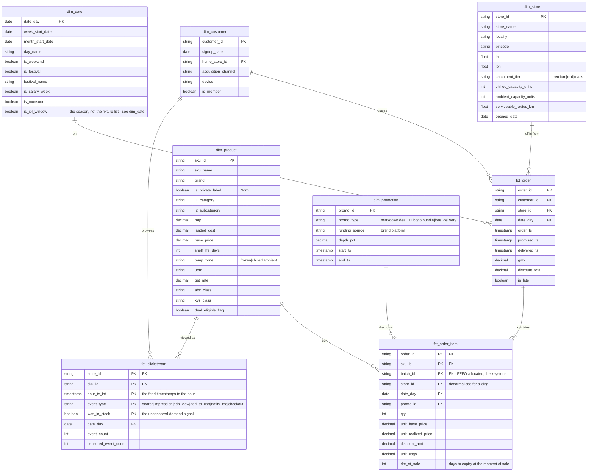
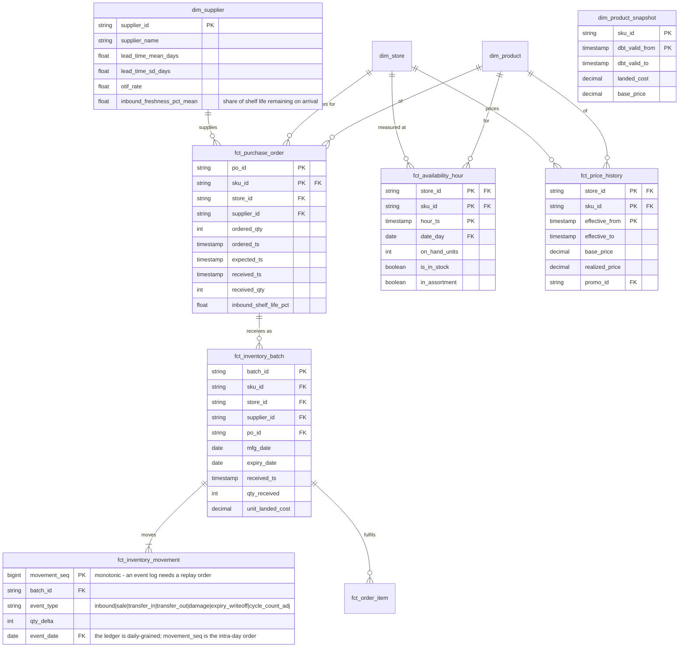

# FreshFlow — Entity Relationship Diagram

Task **S0.4**. The warehouse model, designed before it is built.

Split into three diagrams because a single 25-entity ERD is unreadable. Column
lists are indicative of the modelling decisions that matter, not exhaustive —
the generated dbt docs are the complete reference once the models exist.

> **The keystone decision:** `fct_order_item` carries a **FEFO-allocated
> `batch_id`**. Without that one foreign key there is no way to attribute a sale
> to a specific expiry date, and the entire expiry-risk, markdown and freshness
> analysis becomes impossible. Everything else in this model is ordinary retail
> dimensional design; that column is what makes the project work.

---

## 1. Core transactional star

Orders, what was in them, and who placed them.

**Why `was_in_stock` sits on the clickstream:** it is the only record of demand
that existed while stock was zero. Sales data cannot distinguish "nobody wanted
it" from "we had none", and a forecast trained on the difference under-orders
forever. See plan §2, censored demand.

---

## 2. Inventory, supply and availability

Where the perishability problem actually lives.

**Three modelling notes worth defending in an interview:**

1. **Batch grain, not SKU grain.** `fct_inventory_batch` is one row per physical
   receipt with its own expiry date. Two deliveries of the same SKU on different
   days are different batches with different risk. Modelling inventory at SKU
   level would average away the entire problem.
2. **Movements, not snapshots.** On-hand is derived by a running-sum window over
   `fct_inventory_movement`, so every balance is auditable back to an event. A
   reconciliation test asserts the derived balance equals the ledger exactly.
3. **`dim_product_snapshot` is a dbt snapshot (SCD Type 2).** Landed cost and
   base price change mid-year; margin on a March order must use March's cost.
   Joining live `dim_product` would silently restate history.

---

## 3. Marts, decision outputs and serving

Everything the metric registry reads from.

```mermaid
erDiagram
    agg_store_sku_day    ||--o{ mart_expiry_risk       : "feeds"
    agg_store_sku_day    ||--o{ mart_forecast_accuracy : "feeds"
    mart_expiry_risk     ||--o{ rec_markdown_action    : "triggers"
    mart_expiry_risk     ||--o{ rec_transfer_order     : "triggers"
    mart_expiry_risk     ||--o{ rec_deal_slot          : "triggers"
    mart_customer_360    ||--o{ rec_customer_offer     : "targets"
    agg_store_sku_day    ||--o{ rec_purchase_order     : "drives"
    rec_markdown_action  ||--o{ mart_markdown_perf     : "evaluated by"
    rec_deal_slot        ||--o{ mart_deal_slot_perf    : "evaluated by"

    agg_store_sku_day {
        date    date_day PK
        string  store_id PK "FK"
        string  sku_id PK "FK"
        boolean is_private_label "denormalised from dim_product"
        int     units_sold
        int     units_demanded_imputed "censored-demand corrected"
        boolean is_censored
        decimal net_revenue
        decimal cogs
        int     opening_units
        int     received_units
        int     closing_units
        decimal received_value
        decimal writeoff_value
        int     writeoff_units
        float   trailing_7d_avg_units
        decimal base_price_avg
        decimal realized_price_avg
        int     markdown_units
        decimal markdown_subsidy_platform
        decimal markdown_subsidy_brand
    }

    mart_order_daily {
        date    date_day PK
        string  store_id PK "FK"
        int     orders_count
        decimal net_revenue
        decimal delivery_fee
        int     late_orders
    }

    mart_expiry_risk {
        string  batch_id PK
        date    date_day PK
        string  store_id FK
        string  sku_id FK
        int     on_hand_units
        int     days_to_expiry
        string  dte_band
        float   forecast_residual_demand
        float   expiry_risk_score "P(unsold at expiry)"
        int     units_at_risk
        decimal unit_landed_cost
        string  risk_bucket "low|watch|high|critical"
        string  recommended_action
    }

    mart_forecast_accuracy {
        date    date_day PK
        string  store_id PK "FK"
        string  sku_id PK "FK"
        int     horizon_days PK
        float   actual_units
        float   forecast_units
        float   naive_units "seasonal-naive baseline for FVA"
        boolean was_censored "excluded from evaluation"
    }

    mart_markdown_perf {
        string  store_id PK "FK"
        string  sku_id PK "FK"
        date    date_day PK
        float   p_sell_full_price
        decimal discount_value
        decimal realized_revenue
        decimal landed_cost_value
        int     units_marked_down
    }

    mart_deal_slot_perf {
        string  store_id PK "FK"
        date    date_day PK
        int     slot_rank PK
        string  sku_id FK
        decimal subsidy_value
        int     orders
        int     control_implied_orders
        decimal treated_basket_value
        decimal control_basket_value
    }

    mart_customer_360 {
        string  customer_id PK
        string  store_id FK "home store"
        date    cohort_month
        string  customer_segment
        string  rfm_segment
        string  ddi_band
        boolean active_curr_90d
        boolean active_prev_90d
        boolean ordered_m1
        boolean m1_observable "cohort's M1 falls inside the order feed"
        int     orders_90d
        int     promo_orders_90d
        decimal gross_margin_90d
        decimal delivery_cost_90d
        decimal subsidy_90d
        float   churn_score
    }

    mart_store_scorecard {
        string  store_id PK "FK"
        date    week_start_date PK
        float   gm_awm
        float   wastage_rate_value
        float   in_stock_pct
        float   forecast_wape
    }

    mart_pl_performance {
        string  sku_id PK "FK"
        date    week_start_date PK
        decimal pl_revenue
        decimal cannibalised_revenue
        decimal incremental_revenue
        decimal incremental_margin
    }

    mart_experiment_readout {
        string  metric_name PK
        string  arm PK
        int     seed PK
        float   value
        float   delta_vs_baseline
        float   ci_low
        float   ci_high
    }

    dq_test_results {
        string  test_id PK
        date    date_day PK
        string  source_name
        string  check_type "schema|freshness|distribution|reconciliation"
        string  test_severity "warn|error"
        string  status "pass|fail"
    }

    rec_markdown_action {
        string  batch_id PK
        date    date_day PK
        float   recommended_discount_pct
        int     expected_units_sold
        decimal expected_margin_recovered
        decimal value_at_risk
    }

    rec_transfer_order {
        string  from_store_id PK "FK"
        string  to_store_id PK "FK"
        string  sku_id PK "FK"
        date    date_day PK
        int     qty
        decimal avoided_writeoff_value
        decimal net_benefit
    }

    rec_deal_slot {
        string  store_id PK "FK"
        date    date_day PK
        int     slot_rank PK
        string  sku_id FK
        string  rationale
        decimal expected_subsidy
    }

    rec_customer_offer {
        string  customer_id PK "FK"
        date    date_day PK
        string  offer_type
        string  channel
        float   predicted_uplift
    }

    rec_purchase_order {
        string  store_id PK "FK"
        string  sku_id PK "FK"
        date    date_day PK
        int     order_up_to_level
        int     recommended_qty
        float   service_level_used
    }
```

---

## Table catalogue

| Table | Layer | Grain | Why it exists |
|---|---|---|---|
| `dim_store` | gold | store | 14 Mumbai dark stores |
| `dim_product` | gold | SKU | 1,500 SKUs, ~325 perishable, ~131 private label |
| `dim_product_snapshot` | gold | SKU × valid_from | SCD2 on cost and price, so historical margin is correct |
| `dim_customer` | gold | customer | ~45,000 customers |
| `dim_date` | gold | date | Festival, monsoon and salary-week flags |
| `dim_promotion` | gold | promo | Type and, critically, who funds it |
| `dim_supplier` | gold | supplier | Lead time and inbound freshness variance |
| `fct_order` | gold | order | ~1.6M orders |
| `fct_order_item` | gold | order × SKU × batch | ~4.2M lines. Batch is part of the key: FEFO can split one line across two batches, which is exactly why it is there. |
| `fct_clickstream` | gold | event | Demand signal during stockouts |
| `fct_inventory_batch` | gold | batch | ~700k batches with expiry dates |
| `fct_inventory_movement` | gold | movement | The auditable inventory ledger |
| `fct_availability_hour` | gold | store × SKU × hour | Time-weighted in-stock, stockout intervals |
| `fct_price_history` | gold | store × SKU × effective_from | Realized price including markdowns |
| `fct_purchase_order` | gold | PO line | Ordering behaviour and supplier performance |
| `agg_store_sku_day` | mart | store × SKU × day | The workhorse; most metrics resolve here |
| `mart_order_daily` | mart | store × day | Order counts and AOV |
| `mart_expiry_risk` | mart | batch × day | The hero table: value at risk per batch |
| `mart_forecast_accuracy` | mart | store × SKU × horizon × day | WAPE, bias, forecast value add |
| `mart_markdown_perf` | mart | store × SKU × day | Depth, leakage, margin recovery |
| `mart_deal_slot_perf` | mart | store × day × slot | ₹11 deal incrementality |
| `mart_customer_360` | mart | customer | RFM, cohort, DDI, contribution, churn |
| `mart_store_scorecard` | mart | store × week | Executive view |
| `mart_pl_performance` | mart | SKU × week | Private label incrementality vs cannibalisation |
| `mart_experiment_readout` | mart | metric × arm × seed | The policy A/B result |
| `dq_test_results` | mart | test × day | Data quality page |
| `rec_markdown_action` | output | batch × day | Recommended discount depth |
| `rec_transfer_order` | output | from × to × SKU × day | Recommended inter-store moves |
| `rec_deal_slot` | output | store × day × slot | Today's ₹11 assortment |
| `rec_customer_offer` | output | customer × day | Targeted offers |
| `rec_purchase_order` | output | store × SKU × day | Replenishment quantities |

Every `source:` in [`semantic/metrics.yml`](../../semantic/metrics.yml) must
appear above. [`tests/test_model_contract.py`](../../tests/test_model_contract.py)
enforces it, so the registry and the model cannot drift apart before either is built.
